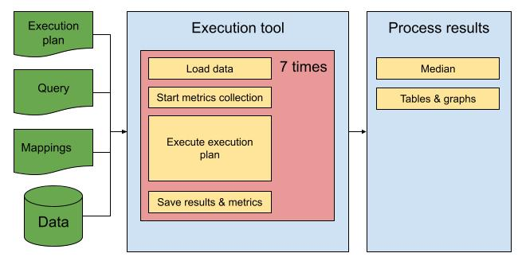

# bench-executor

Bench-executor is a simple tool to execute benchmarks on tools which are running
in Docker.

## Setup

The tool executes the cases as followed:

1. Data is loaded (if needed), depending on the execution plan.
2. Collecting of metrics such as execution time is started.
3. The execution plan is executed, step-by-step. 
Each case has data, mappings and queries to execute 
according to a [specific execution plan](#generating-cases) which gets executed,
for example, 7 times.
4. When the execution is complete, the median run based on execution time is used
to generate tables and graphs.



## How to use?

You can list all options and arguments with `--help`

```
usage: bench-executor [-h] [--version] [--root MAIN_DIRECTORY] [--runs NUMBER_OF_RUNS] [--interval INTERVAL]
                      [--verbose] [--fail-fast] [--wait-for-user]
                      command

Copyright by (c) ANONYMOUS (2022), available under Apache-2.0 license

positional arguments:
  command               Command to execute, available commands: "list", "run"

options:
  -h, --help            show this help message and exit
  --version             show program's version number and exit
  --root MAIN_DIRECTORY
                        Root directory of all cases to execute, defaults to the current working directory
  --runs NUMBER_OF_RUNS
                        Number of runs to execute a case. The value must be uneven for generating stats. Default 3
                        runs
  --interval INTERVAL   Measurement sample interval for metrics, default 0.1s
  --verbose             Turn on verbose output
  --fail-fast           Immediately exit when a case fails
  --wait-for-user       Show a prompt when a case is done before going to the next one

Please cite our paper if you make use of this tool
```

### Generating cases

Each case you want to execute expects the following structure:

```
/path/to/my/case
├── data
│   └── shared
│       ├── file1
│       ├── file2
│       └── file3
└── metadata.json
```

Data shared among resources should be stored under the `./data/shared` folder
of the case, the steps to execute should be stored in `./metadata.json`.

The steps are described as followed:

```
{
    "@id": "http://example.com/case/ID", # Unique IRI for your case
    "name": "Case X: Apple: Pie", # Readable name for your case
    "description": "Bananas", # Readable description for your case
    "steps": [
        {
            "@id": "http://example.com/case/ID#step1", # Unique IRI for your step
            "name": "My Step Description", # Readable name of your step
            "resource": "$RESOURCE", # Name of resource to execute, matching $RESOURCE.py
            "command": "$METHOD", # Method to execute of the resource, defined in $RESOURCE.py
            "parameters": { # Parameters to supply with the method to execute, defined in $RESOURCE.py
                "param1": "MyParameter",
                "param2": 5
            }
        },
        ... # Infinite number of steps allowed
    ]
}
```

Real examples can be found under [bench_executor/data/test-cases/](bench_executor/data/test-cases/).

### Listing all cases

You can list all cases from a certain root folder with:

```
bench-executor list
```

By default, the root directory is set to the current working directory.
If you want to set a different one, use the `--root` argument:

```
bench-executor list --root=/path/to/your/cases
```

### Running all cases

Running all cases under a root directory is similar to listing them:

```
bench-executor run
```

If you want to specify the number of runs, metrics collection interval, 
and the root directory:

```
bench-executor list --root=/path/to/your/cases --runs=5 --interval 1.0
```

This will execute all cases at `/path/to/your/cases`,
each case will be executed 5 times,
and the metrics will be collected every `1.0` seconds.

#### Additional features

If you want to pause the execution of your case after each step,
you can add the `--wait-for-user` argument when running the cases:

```
bench-executor run --wait-for-user
```

This way, you can debug resources when they are not working properly or testing
your setup.

If you want to make sure the executor exits immediately when a case failed,
add the `--fail-fast` argument:

```
bench-executor run --fail-fast
```

### Cleaning all cases

Sometimes you want to start from a clean slate, you can clean all cases under 
the given root directory with:

```
bench-executor clean
```

All collected metrics and log files will be deleted, be careful!

## Installation

**Ubuntu 22.04 LTS**

Ubuntu 22.04 LTS or later is required because this is the first LTS version
with default CGroupFSv2 support. This tool will not function when not using the
GroupFSv2 SystemD driver in Docker! Patches are welcome to support other 
CGroupFS configurations.

You can check the CGroupFS driver with `docker info`:

```
Cgroup Driver: systemd
Cgroup Version: 2
```

1. Install dependencies

```
sudo apt install zlib1g zlib1g-dev libpq-dev libjpeg-dev python3-pip docker.io
pip install --user -r requirements.txt
```

2. Configure Docker

```
# Add user to docker group
sudo groupadd docker
sudo usermod -aG docker $USER
```

Do not forget to logout so the user groups are properly updated!

3. Verify installation

```
# Run all tests
cd bench_executor
./tests
```

## License

Licensed under the Apache-2.0 license
Copyright (c) by ANONYMOUS (2022)

