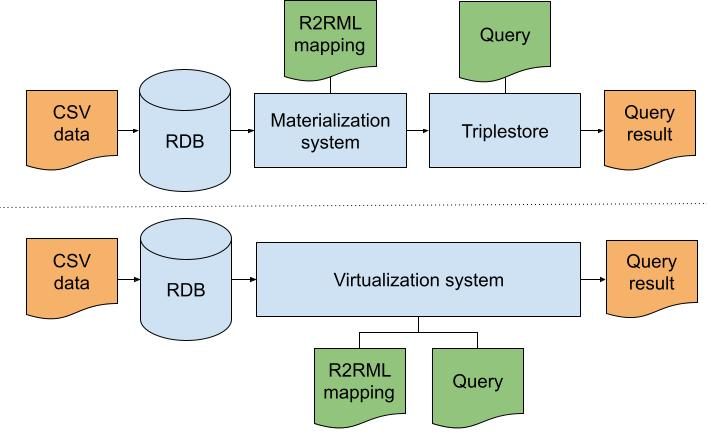

# SANTA: Synthetic mAterializatioN virtualizaTion Analysis

SANTA is a set of testbeds with synthetic data for a fine-grained assessment of the systems with respect to the data and mapping rules.
Each testbed consist of:

- Data in CSV which is loaded into a SQL database using the [tool](https://github.com/blindreviewing/eswc2023-materialization-virtualization).
The CSV files are loaded into a table without any indexes or other optimizations to not give an edge for any approach.
- R2RML mapping rules to transform the data into a knowledge graph. Engines which do not support R2RML such as SDM-RDFizer, 
use RML mapping rules which are automatically generated from the R2RML mappings. This is achieved by replacing `rr:column` 
by `rml:reference` and incorporating a `rml:LogicalSource` into the mapping rules describing access to the SQL database 
where the data is stored. This is possible because RML is backwards compatible with R2RML. 
This transformation is performed automatically by the tool.
- SPARQL query to retrieve the knowledge graph in the form of Basic Graph Patterns.

The testbeds scale up a specific parameter to investigate the influence of it on the knowledge graph construction
and retrieving the knowledge graph as query results.

**Overview**

1. [Testbeds: Data parameters](#testbeds-data-parameters)
2. [Testbeds: Mapping parameters](#testbeds-mapping-parameters)
3. [Testbeds: Execution parameters](#testbeds-execution-parameters)

## Execution setup

SANTA is executed as visualized in the figure for both materialization and virtualization systems:



**Materialization setup**
1. CSV data is loaded into the relational database (RDB) by the [tool](https://github.com/blindreviewing/eswc2023-materialization-virtualization).
2. The materialization system executes the R2RML mappings with the RDB as source.
3. The generated knowledge graph is loaded into the triplestore.
4. The query is executed on the triplestore and the query results are stored on disk.

**Virtualization setup**
1. CSV data is loaded into the relational database (RDB) by the [tool](https://github.com/blindreviewing/eswc2023-materialization-virtualization).
2. The query is executed by the virtualization system by leveraging the R2RML mappings and the RDB as source.
3. The query results are stored on disk.

## Testbeds: Data parameters

**Number of data records**

The number of data records involved during the knowledge graph construction scaled with 1K, 5K, 25K, and 125K records and 15 properties.
Each record has an ID which is used to generate the subject of triple and 15 unique values for generating 15 Predicate Object Maps.
Each mapping file consists of a single Triples Map with multiple Predicate Object Maps which map all the provided properties of a record.
Each SPARQL query is a CONSTRUCT query and consists of Basic Graph Patterns to retrieve the complete knowledge graph.

For example, 5K rows with 15 properties looks like this:

```
id,p1,p2,p3,p4,p5,p6,p7,p8,p9,p10,p11,p12,p13,p14,p15
1,V_1-1,V_2-1,V_3-1,V_4-1,V_5-1,V_6-1,V_7-1,V_8-1,V_9-1,V_10-1,V_11-1,V_12-1,V_13-1,V_14-1,V_15-1
2,V_1-2,V_2-2,V_3-2,V_4-2,V_5-2,V_6-2,V_7-2,V_8-2,V_9-2,V_10-2,V_11-2,V_12-2,V_13-2,V_14-2,V_15-2
3,V_1-3,V_2-3,V_3-3,V_4-3,V_5-3,V_6-3,V_7-3,V_8-3,V_9-3,V_10-3,V_11-3,V_12-3,V_13-3,V_14-3,V_15-3
4,V_1-4,V_2-4,V_3-4,V_4-4,V_5-4,V_6-4,V_7-4,V_8-4,V_9-4,V_10-4,V_11-4,V_12-4,V_13-4,V_14-4,V_15-4
5,V_1-5,V_2-5,V_3-5,V_4-5,V_5-5,V_6-5,V_7-5,V_8-5,V_9-5,V_10-5,V_11-5,V_12-5,V_13-5,V_14-5,V_15-5
6,V_1-6,V_2-6,V_3-6,V_4-6,V_5-6,V_6-6,V_7-6,V_8-6,V_9-6,V_10-6,V_11-6,V_12-6,V_13-6,V_14-6,V_15-6
7,V_1-7,V_2-7,V_3-7,V_4-7,V_5-7,V_6-7,V_7-7,V_8-7,V_9-7,V_10-7,V_11-7,V_12-7,V_13-7,V_14-7,V_15-7
8,V_1-8,V_2-8,V_3-8,V_4-8,V_5-8,V_6-8,V_7-8,V_8-8,V_9-8,V_10-8,V_11-8,V_12-8,V_13-8,V_14-8,V_15-8
9,V_1-9,V_2-9,V_3-9,V_4-9,V_5-9,V_6-9,V_7-9,V_8-9,V_9-9,V_10-9,V_11-9,V_12-9,V_13-9,V_14-9,V_15-9
```

And has the following mapping file:

```
@base <http://ex.com/> .
@prefix ex: <http://example.com/> .
@prefix rr: <http://www.w3.org/ns/r2rml#> .

<#TriplesMap1> a rr:TriplesMap ;
    rr:logicalTable [ rr:tableName "data" ] ;
    rr:predicateObjectMap [ a rr:PredicateObjectMap ;
            rr:objectMap [ a rr:ObjectMap ;
                    rr:column "p2" ] ;
            rr:predicateMap [ a rr:PredicateMap ;
                    rr:constant ex:p2 ] ],
        [ a rr:PredicateObjectMap ;
            rr:objectMap [ a rr:ObjectMap ;
                    rr:column "p6" ] ;
            rr:predicateMap [ a rr:PredicateMap ;
                    rr:constant ex:p6 ] ],
        [ a rr:PredicateObjectMap ;
            rr:objectMap [ a rr:ObjectMap ;
                    rr:column "p8" ] ;
            rr:predicateMap [ a rr:PredicateMap ;
                    rr:constant ex:p8 ] ],
        [ a rr:PredicateObjectMap ;
            rr:objectMap [ a rr:ObjectMap ;
                    rr:column "p5" ] ;
            rr:predicateMap [ a rr:PredicateMap ;
                    rr:constant ex:p5 ] ],
        [ a rr:PredicateObjectMap ;
            rr:objectMap [ a rr:ObjectMap ;
                    rr:column "p3" ] ;
            rr:predicateMap [ a rr:PredicateMap ;
                    rr:constant ex:p3 ] ],
        [ a rr:PredicateObjectMap ;
            rr:objectMap [ a rr:ObjectMap ;
                    rr:column "p10" ] ;
            rr:predicateMap [ a rr:PredicateMap ;
                    rr:constant ex:p10 ] ],
        [ a rr:PredicateObjectMap ;
            rr:objectMap [ a rr:ObjectMap ;
                    rr:column "p9" ] ;
            rr:predicateMap [ a rr:PredicateMap ;
                    rr:constant ex:p9 ] ],
        [ a rr:PredicateObjectMap ;
            rr:objectMap [ a rr:ObjectMap ;
                    rr:column "p14" ] ;
            rr:predicateMap [ a rr:PredicateMap ;
                    rr:constant ex:p14 ] ],
        [ a rr:PredicateObjectMap ;
            rr:objectMap [ a rr:ObjectMap ;
                    rr:column "p1" ] ;
            rr:predicateMap [ a rr:PredicateMap ;
                    rr:constant ex:p1 ] ],
        [ a rr:PredicateObjectMap ;
            rr:objectMap [ a rr:ObjectMap ;
                    rr:column "p4" ] ;
            rr:predicateMap [ a rr:PredicateMap ;
                    rr:constant ex:p4 ] ],
        [ a rr:PredicateObjectMap ;
            rr:objectMap [ a rr:ObjectMap ;
                    rr:column "p12" ] ;
            rr:predicateMap [ a rr:PredicateMap ;
                    rr:constant ex:p12 ] ],
        [ a rr:PredicateObjectMap ;
            rr:objectMap [ a rr:ObjectMap ;
                    rr:column "p11" ] ;
            rr:predicateMap [ a rr:PredicateMap ;
                    rr:constant ex:p11 ] ],
        [ a rr:PredicateObjectMap ;
            rr:objectMap [ a rr:ObjectMap ;
                    rr:column "p15" ] ;
            rr:predicateMap [ a rr:PredicateMap ;
                    rr:constant ex:p15 ] ],
        [ a rr:PredicateObjectMap ;
            rr:objectMap [ a rr:ObjectMap ;
                    rr:column "p13" ] ;
            rr:predicateMap [ a rr:PredicateMap ;
                    rr:constant ex:p13 ] ],
        [ a rr:PredicateObjectMap ;
            rr:objectMap [ a rr:ObjectMap ;
                    rr:column "p7" ] ;
            rr:predicateMap [ a rr:PredicateMap ;
                    rr:constant ex:p7 ] ] ;
    rr:subjectMap [ rr:template "http://ex.com/table/{id}" ] .
```

All 15 properties are mapped during the knowledge graph construction process,
5K records results in 5K subjects with each 15 predicate objects, which is in total 75K triples.
The following SPARQL CONSTRUCT query is used to retrieve these 75K triples:

```
PREFIX ex: <http://example.com/> CONSTRUCT WHERE {
 ?s ex:p1 ?o1 .
 ?s ex:p2 ?o2 .
 ?s ex:p3 ?o3 .
 ?s ex:p4 ?o4 .
 ?s ex:p5 ?o5 .
 ?s ex:p6 ?o6 .
 ?s ex:p7 ?o7 .
 ?s ex:p8 ?o8 .
 ?s ex:p9 ?o9 .
 ?s ex:p10 ?o10 .
 ?s ex:p11 ?o11 .
 ?s ex:p12 ?o12 .
 ?s ex:p13 ?o13 .
 ?s ex:p14 ?o14 .
 ?s ex:p15 ?o15 .
}
```

This testbed does not access the influence of the query, but solely focus on investigating
how the knowledge graph construction process is affected by the number of records for a system.

**Number of data properties**

The number of data properties involved during the knowledge graph construction scaled with 1, 5, 10, and 15 properties, each scaling uses 25K records.
Each mapping file consists of a single Triples Map with multiple Predicate Object Maps which map all the provided properties of a record.
Each SPARQL query is a CONSTRUCT query and consists of Basic Graph Patterns to retrieve the complete knowledge graph.

For example, 10 properties and 25K rows looks like this:

```
id,p1,p2,p3,p4,p5,p6,p7,p8,p9,p10
1,V_1-1,V_2-1,V_3-1,V_4-1,V_5-1,V_6-1,V_7-1,V_8-1,V_9-1,V_10-1
2,V_1-2,V_2-2,V_3-2,V_4-2,V_5-2,V_6-2,V_7-2,V_8-2,V_9-2,V_10-2
3,V_1-3,V_2-3,V_3-3,V_4-3,V_5-3,V_6-3,V_7-3,V_8-3,V_9-3,V_10-3
4,V_1-4,V_2-4,V_3-4,V_4-4,V_5-4,V_6-4,V_7-4,V_8-4,V_9-4,V_10-4
5,V_1-5,V_2-5,V_3-5,V_4-5,V_5-5,V_6-5,V_7-5,V_8-5,V_9-5,V_10-5
6,V_1-6,V_2-6,V_3-6,V_4-6,V_5-6,V_6-6,V_7-6,V_8-6,V_9-6,V_10-6
7,V_1-7,V_2-7,V_3-7,V_4-7,V_5-7,V_6-7,V_7-7,V_8-7,V_9-7,V_10-7
8,V_1-8,V_2-8,V_3-8,V_4-8,V_5-8,V_6-8,V_7-8,V_8-8,V_9-8,V_10-8
9,V_1-9,V_2-9,V_3-9,V_4-9,V_5-9,V_6-9,V_7-9,V_8-9,V_9-9,V_10-9
```

And has the following mapping file:

```
@base <http://ex.com/> .
@prefix ex: <http://example.com/> .
@prefix rr: <http://www.w3.org/ns/r2rml#> .

<#TriplesMap1> a rr:TriplesMap ;
    rr:logicalTable [ rr:tableName "data" ] ;
    rr:predicateObjectMap [ a rr:PredicateObjectMap ;
            rr:objectMap [ a rr:ObjectMap ;
                    rr:column "p5" ] ;
            rr:predicateMap [ a rr:PredicateMap ;
                    rr:constant ex:p5 ] ],
        [ a rr:PredicateObjectMap ;
            rr:objectMap [ a rr:ObjectMap ;
                    rr:column "p3" ] ;
            rr:predicateMap [ a rr:PredicateMap ;
                    rr:constant ex:p3 ] ],
        [ a rr:PredicateObjectMap ;
            rr:objectMap [ a rr:ObjectMap ;
                    rr:column "p8" ] ;
            rr:predicateMap [ a rr:PredicateMap ;
                    rr:constant ex:p8 ] ],
        [ a rr:PredicateObjectMap ;
            rr:objectMap [ a rr:ObjectMap ;
                    rr:column "p1" ] ;
            rr:predicateMap [ a rr:PredicateMap ;
                    rr:constant ex:p1 ] ],
        [ a rr:PredicateObjectMap ;
            rr:objectMap [ a rr:ObjectMap ;
                    rr:column "p10" ] ;
            rr:predicateMap [ a rr:PredicateMap ;
                    rr:constant ex:p10 ] ],
        [ a rr:PredicateObjectMap ;
            rr:objectMap [ a rr:ObjectMap ;
                    rr:column "p6" ] ;
            rr:predicateMap [ a rr:PredicateMap ;
                    rr:constant ex:p6 ] ],
        [ a rr:PredicateObjectMap ;
            rr:objectMap [ a rr:ObjectMap ;
                    rr:column "p9" ] ;
            rr:predicateMap [ a rr:PredicateMap ;
                    rr:constant ex:p9 ] ],
        [ a rr:PredicateObjectMap ;
            rr:objectMap [ a rr:ObjectMap ;
                    rr:column "p2" ] ;
            rr:predicateMap [ a rr:PredicateMap ;
                    rr:constant ex:p2 ] ],
        [ a rr:PredicateObjectMap ;
            rr:objectMap [ a rr:ObjectMap ;
                    rr:column "p4" ] ;
            rr:predicateMap [ a rr:PredicateMap ;
                    rr:constant ex:p4 ] ],
        [ a rr:PredicateObjectMap ;
            rr:objectMap [ a rr:ObjectMap ;
                    rr:column "p7" ] ;
            rr:predicateMap [ a rr:PredicateMap ;
                    rr:constant ex:p7 ] ] ;
    rr:subjectMap [ rr:template "http://ex.com/table/{id}" ] .
```

All 10 properties are mapped during the knowledge graph construction process,
25K records results in 25K subjects with each 5 predicate objects, which is in total 250K triples.
The following SPARQL CONSTRUCT query is used to retrieve these 250K triples:

```
PREFIX ex: <http://example.com/> CONSTRUCT WHERE {
 ?s ex:p1 ?o1 .
 ?s ex:p2 ?o2 .
 ?s ex:p3 ?o3 .
 ?s ex:p4 ?o4 .
 ?s ex:p5 ?o5 .
 ?s ex:p6 ?o6 .
 ?s ex:p7 ?o7 .
 ?s ex:p8 ?o8 .
 ?s ex:p9 ?o9 .
 ?s ex:p10 ?o10 .
}
```

This testbed does not access the influence of the query, but solely focus on investigating
how the knowledge graph construction process is affected by the number of properties for a system.

**Duplicate values**

The impact of duplicated values in the original data is investigated by scaling the percentage of the 25K records and  
containing duplicates with 0%, 25%, 50%, 75%, and 100%. Each record has 15 properties with unique values, 
except for the percentage of records which have duplicates. All properties of these records contain a duplicate value.
This looks as followed:

```
id,p1,p2,p3,p4,p5,p6,p7,p8,p9,p10,p11,p12,p13,p14,p15
1,V_1-1,V_2-1,V_3-1,V_4-1,V_5-1,V_6-1,V_7-1,V_8-1,V_9-1,V_10-1,V_11-1,V_12-1,V_13-1,V_14-1,V_15-1
2,V_1-2,V_2-2,V_3-2,V_4-2,V_5-2,V_6-2,V_7-2,V_8-2,V_9-2,V_10-2,V_11-2,V_12-2,V_13-2,V_14-2,V_15-2
3,V_1-3,V_2-3,V_3-3,V_4-3,V_5-3,V_6-3,V_7-3,V_8-3,V_9-3,V_10-3,V_11-3,V_12-3,V_13-3,V_14-3,V_15-3
4,V_1-4,V_2-4,V_3-4,V_4-4,V_5-4,V_6-4,V_7-4,V_8-4,V_9-4,V_10-4,V_11-4,V_12-4,V_13-4,V_14-4,V_15-4
DUPLICATE,DUPLICATE,DUPLICATE,DUPLICATE,DUPLICATE,DUPLICATE,DUPLICATE,DUPLICATE,DUPLICATE,DUPLICATE,DUPLICATE,DUPLICATE,DUPLICATE,DUPLICATE,DUPLICATE,DUPLICATE
DUPLICATE,DUPLICATE,DUPLICATE,DUPLICATE,DUPLICATE,DUPLICATE,DUPLICATE,DUPLICATE,DUPLICATE,DUPLICATE,DUPLICATE,DUPLICATE,DUPLICATE,DUPLICATE,DUPLICATE,DUPLICATE
7,V_1-7,V_2-7,V_3-7,V_4-7,V_5-7,V_6-7,V_7-7,V_8-7,V_9-7,V_10-7,V_11-7,V_12-7,V_13-7,V_14-7,V_15-7
8,V_1-8,V_2-8,V_3-8,V_4-8,V_5-8,V_6-8,V_7-8,V_8-8,V_9-8,V_10-8,V_11-8,V_12-8,V_13-8,V_14-8,V_15-8
DUPLICATE,DUPLICATE,DUPLICATE,DUPLICATE,DUPLICATE,DUPLICATE,DUPLICATE,DUPLICATE,DUPLICATE,DUPLICATE,DUPLICATE,DUPLICATE,DUPLICATE,DUPLICATE,DUPLICATE,DUPLICATE
```

The same mappings and query are used for 15 properties, as seen in _Number of data records_ above.
This testbed does not access the influence of the query, but solely focus on investigating
how the knowledge graph construction process is affected by the number of duplicates for a system.

**Empty values**

The impact of empty values in the original data is investigated by scaling the percentage of the 25K records and  
containing empty values with 0%, 25%, 50%, 75%, and 100%, similar to duplicates.
Each data record that contains empty values does not contain a duplicate value, but has an empty value `NULL` instead:

```
id,p1,p2,p3,p4,p5,p6,p7,p8,p9,p10,p11,p12,p13,p14,p15
1,NULL,NULL,NULL,NULL,NULL,NULL,NULL,NULL,NULL,NULL,NULL,NULL,NULL,NULL,NULL
2,NULL,NULL,NULL,NULL,NULL,NULL,NULL,NULL,NULL,NULL,NULL,NULL,NULL,NULL,NULL
3,NULL,NULL,NULL,NULL,NULL,NULL,NULL,NULL,NULL,NULL,NULL,NULL,NULL,NULL,NULL
4,NULL,NULL,NULL,NULL,NULL,NULL,NULL,NULL,NULL,NULL,NULL,NULL,NULL,NULL,NULL
5,NULL,NULL,NULL,NULL,NULL,NULL,NULL,NULL,NULL,NULL,NULL,NULL,NULL,NULL,NULL
6,NULL,NULL,NULL,NULL,NULL,NULL,NULL,NULL,NULL,NULL,NULL,NULL,NULL,NULL,NULL
7,NULL,NULL,NULL,NULL,NULL,NULL,NULL,NULL,NULL,NULL,NULL,NULL,NULL,NULL,NULL
8,NULL,NULL,NULL,NULL,NULL,NULL,NULL,NULL,NULL,NULL,NULL,NULL,NULL,NULL,NULL
9,V_1-9,V_2-9,V_3-9,V_4-9,V_5-9,V_6-9,V_7-9,V_8-9,V_9-9,V_10-9,V_11-9,V_12-9,V_13-9,V_14-9,V_15-9
```

The empty values are represented as `NULL` in a SQL database.
The same mappings and query are used for 15 properties, as seen in _Number of data records_ above.
This testbed does not access the influence of the query, but solely focus on investigating
how the knowledge graph construction process is affected by the number of empty values for a system.

### Testbeds: Mapping parameters

**Number of Subjects, Predicates, Objects**

The impact of the number of subjects, predicates and objects (Basic Graph Patterns) generated during knowledge graph construction 
is investigated by scaling the number of Triples Maps (TM) with each a Subject Map and Predicate Object Maps (POM)
with the following scales: 1TM+15POM, 3TM+5POM, 5TM+3POM + 15TM+1POM which all generates 375K triples.
The size of the knowledge graph remains the same, but the Basic Graph Patterns change during the scaling.

For example, 3TMs+5POMs has the following data:

```
id,p1,p2,p3,p4,p5,p6,p7,p8,p9,p10,p11,p12,p13,p14,p15
1,V_1-1,V_2-1,V_3-1,V_4-1,V_5-1,V_6-1,V_7-1,V_8-1,V_9-1,V_10-1,V_11-1,V_12-1,V_13-1,V_14-1,V_15-1
2,V_1-2,V_2-2,V_3-2,V_4-2,V_5-2,V_6-2,V_7-2,V_8-2,V_9-2,V_10-2,V_11-2,V_12-2,V_13-2,V_14-2,V_15-2
3,V_1-3,V_2-3,V_3-3,V_4-3,V_5-3,V_6-3,V_7-3,V_8-3,V_9-3,V_10-3,V_11-3,V_12-3,V_13-3,V_14-3,V_15-3
4,V_1-4,V_2-4,V_3-4,V_4-4,V_5-4,V_6-4,V_7-4,V_8-4,V_9-4,V_10-4,V_11-4,V_12-4,V_13-4,V_14-4,V_15-4
5,V_1-5,V_2-5,V_3-5,V_4-5,V_5-5,V_6-5,V_7-5,V_8-5,V_9-5,V_10-5,V_11-5,V_12-5,V_13-5,V_14-5,V_15-5
6,V_1-6,V_2-6,V_3-6,V_4-6,V_5-6,V_6-6,V_7-6,V_8-6,V_9-6,V_10-6,V_11-6,V_12-6,V_13-6,V_14-6,V_15-6
7,V_1-7,V_2-7,V_3-7,V_4-7,V_5-7,V_6-7,V_7-7,V_8-7,V_9-7,V_10-7,V_11-7,V_12-7,V_13-7,V_14-7,V_15-7
8,V_1-8,V_2-8,V_3-8,V_4-8,V_5-8,V_6-8,V_7-8,V_8-8,V_9-8,V_10-8,V_11-8,V_12-8,V_13-8,V_14-8,V_15-8
9,V_1-9,V_2-9,V_3-9,V_4-9,V_5-9,V_6-9,V_7-9,V_8-9,V_9-9,V_10-9,V_11-9,V_12-9,V_13-9,V_14-9,V_15-9
```

And mappings:

```
@base <http://ex.com/> .
@prefix ex: <http://example.com/> .
@prefix rr: <http://www.w3.org/ns/r2rml#> .

<#TriplesMap1> a rr:TriplesMap ;
    rr:logicalTable [ rr:tableName "data" ] ;
    rr:predicateObjectMap [ a rr:PredicateObjectMap ;
            rr:objectMap [ a rr:ObjectMap ;
                    rr:column "p2" ] ;
            rr:predicateMap [ a rr:PredicateMap ;
                    rr:constant ex:p2 ] ],
        [ a rr:PredicateObjectMap ;
            rr:objectMap [ a rr:ObjectMap ;
                    rr:column "p4" ] ;
            rr:predicateMap [ a rr:PredicateMap ;
                    rr:constant ex:p4 ] ],
        [ a rr:PredicateObjectMap ;
            rr:objectMap [ a rr:ObjectMap ;
                    rr:column "p5" ] ;
            rr:predicateMap [ a rr:PredicateMap ;
                    rr:constant ex:p5 ] ],
        [ a rr:PredicateObjectMap ;
            rr:objectMap [ a rr:ObjectMap ;
                    rr:column "p1" ] ;
            rr:predicateMap [ a rr:PredicateMap ;
                    rr:constant ex:p1 ] ],
        [ a rr:PredicateObjectMap ;
            rr:objectMap [ a rr:ObjectMap ;
                    rr:column "p3" ] ;
            rr:predicateMap [ a rr:PredicateMap ;
                    rr:constant ex:p3 ] ] ;
    rr:subjectMap [ rr:template "http://ex.com/table/{p1}" ] .

<#TriplesMap2> a rr:TriplesMap ;
    rr:logicalTable [ rr:tableName "data" ] ;
    rr:predicateObjectMap [ a rr:PredicateObjectMap ;
            rr:objectMap [ a rr:ObjectMap ;
                    rr:column "p2" ] ;
            rr:predicateMap [ a rr:PredicateMap ;
                    rr:constant ex:p2 ] ],
        [ a rr:PredicateObjectMap ;
            rr:objectMap [ a rr:ObjectMap ;
                    rr:column "p1" ] ;
            rr:predicateMap [ a rr:PredicateMap ;
                    rr:constant ex:p1 ] ],
        [ a rr:PredicateObjectMap ;
            rr:objectMap [ a rr:ObjectMap ;
                    rr:column "p5" ] ;
            rr:predicateMap [ a rr:PredicateMap ;
                    rr:constant ex:p5 ] ],
        [ a rr:PredicateObjectMap ;
            rr:objectMap [ a rr:ObjectMap ;
                    rr:column "p3" ] ;
            rr:predicateMap [ a rr:PredicateMap ;
                    rr:constant ex:p3 ] ],
        [ a rr:PredicateObjectMap ;
            rr:objectMap [ a rr:ObjectMap ;
                    rr:column "p4" ] ;
            rr:predicateMap [ a rr:PredicateMap ;
                    rr:constant ex:p4 ] ] ;
    rr:subjectMap [ rr:template "http://ex.com/table/{p2}" ] .

<#TriplesMap3> a rr:TriplesMap ;
    rr:logicalTable [ rr:tableName "data" ] ;
    rr:predicateObjectMap [ a rr:PredicateObjectMap ;
            rr:objectMap [ a rr:ObjectMap ;
                    rr:column "p4" ] ;
            rr:predicateMap [ a rr:PredicateMap ;
                    rr:constant ex:p4 ] ],
        [ a rr:PredicateObjectMap ;
            rr:objectMap [ a rr:ObjectMap ;
                    rr:column "p2" ] ;
            rr:predicateMap [ a rr:PredicateMap ;
                    rr:constant ex:p2 ] ],
        [ a rr:PredicateObjectMap ;
            rr:objectMap [ a rr:ObjectMap ;
                    rr:column "p3" ] ;
            rr:predicateMap [ a rr:PredicateMap ;
                    rr:constant ex:p3 ] ],
        [ a rr:PredicateObjectMap ;
            rr:objectMap [ a rr:ObjectMap ;
                    rr:column "p5" ] ;
            rr:predicateMap [ a rr:PredicateMap ;
                    rr:constant ex:p5 ] ],
        [ a rr:PredicateObjectMap ;
            rr:objectMap [ a rr:ObjectMap ;
                    rr:column "p1" ] ;
            rr:predicateMap [ a rr:PredicateMap ;
                    rr:constant ex:p1 ] ] ;
```

3 Triples Maps with 3 different Subject Maps and each 5 Predicate Object Maps.
125K triples are generated by each Triples Map.

The following query is used:

```
PREFIX ex: <http://example.com/> CONSTRUCT WHERE {
 ?s ex:p1 ?o1 .
 ?s ex:p2 ?o2 .
 ?s ex:p3 ?o3 .
 ?s ex:p4 ?o4 .
 ?s ex:p5 ?o5 .
}
```

This returns all the 375K triples but with 3 different subjects instead of 1 as with the previous testbeds.

**Number of Joins**

We scale the number of joins for the following join relations: 1-1, 1-N, N-1, and N-M:

- 1-1
- 1-3, 1-5, 1-10, 1-15
- 3-1, 5-1, 10-1, 15-1
- 3-3, 5-3, 3-5, 10-5, 5-10

Each scaling use 25K records with 15 properties, but the join is only applied on a single property of a record
as visualized in the mappings:

```
@base <http://ex.com/> .
@prefix ex: <http://example.com/> .
@prefix rr: <http://www.w3.org/ns/r2rml#> .

<#TriplesMap1> a rr:TriplesMap ;
    rr:logicalTable [ rr:tableName "data1" ] ;
    rr:predicateObjectMap [ a rr:PredicateObjectMap ;
            rr:objectMap [ a rr:ReferenceObjectMap ;
                    rr:joinCondition [ a rr:JoinCondition ;
                            rr:child "p1" ;
                            rr:parent "p1" ] ;
                    rr:parentTriplesMap <#TriplesMap2> ] ;
            rr:predicateMap [ a rr:PredicateMap ;
                    rr:constant ex:j1 ] ] ;
    rr:subjectMap [ rr:template "http://ex.com/table1/{id}" ] .

<#TriplesMap2> a rr:TriplesMap ;
    rr:logicalTable [ rr:tableName "data2" ] ;
    rr:subjectMap [ rr:template "http://ex.com/table2/{id}" ] .
```

Only the triples generated during the join are queried to avoid impact from other parameters such as number of properties:

```
PREFIX ex: <http://example.com/> CONSTRUCT WHERE {
 ?s ex:j1 ?o .
}
```

**Duplicates during joins**

During joins, duplicated triples can be generated which impact is being investigated in this testbed
by scaling the number of records that generate duplicates per join.
We used the following scaling: 0, 5, 10 and 15 duplicates. This means that if a join is performed with 5 duplicates, 
5 triples will be generated for this join which are all duplicates of each other.
If these are removed, a single triple remains, but this removal process comes with a cost.
They can be removed during the join or after generating the knowledge graph.
We used the same mappings and query as with _Number of Joins_ above.

### Testbeds: Execution parameters

**Parallel loading**

Some materialization systems allow to load triples in parallel fashion to speed up this part of the process.
This is the case for Virtuoso in combination with Morph-KGC on which this testbed is applied.
In this testbed, the number of CPU cores are scaled up to investigate how parallelization affects the loading 
process of the triples. We scale the number of CPU cores with 1, 8, 16, 24, and 32.
The same data, mappings, and query (see _Number of data records_) is used for all scalings: 125K records with 15 properties.
